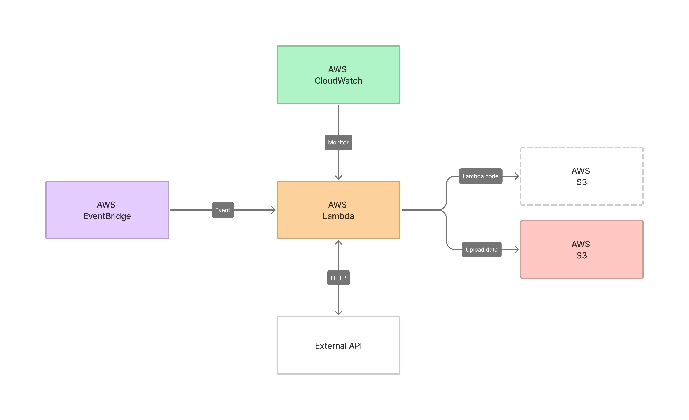

# Freya 

An event-driven application that consists of AWS EventBridge, AWS Lambda, AWS CloudWatch, and AWS S3. 

**Technologies**: Clojure, Terraform, Jenkins, and AWS. <br> 
**Versions**: Leiningen 2.9.8, Java 1.8.0 _(Corretto 8)_, Terraform v1.2.2, Jenkins JVM on Java 11 _(jdk11)_

* [Overview](#overview)
* [Components](#components)
* [Infrastructure](#infrastructure)
  * [Terraform](#terraform)
  * [AWS](#aws)
    * [AWS Lambda](#aws-lambda)
    * [AWS CloudWatch](#aws-cloudwatch)
    * [AWS EventBridge](#aws-eventbridge)
    * [AWS S3](#aws-s3)
    * [AWS CLI](#aws-cli)
* [CI/CD](#cicd)
  * [Jenkins](#jenkins)
  * [Deployment](#deployment)
* [Local Development](#local-development)
  * [Initial Dependencies](#initial-dependencies)
* [Sources](#sources)

## Overview 



## Components
todo...

## Infrastructure
todo... (iac)

### Terraform
todo...
Comprehensive documentation of the infrastructure is located [here](freya-infrastructure/README.md)

### AWS CLI

## CI/CD
### Jenkins
### Deployment

## Local Development

### Initial Dependencies
Install initial dependencies required for local development by running `scripts/install-dependencies.sh`
```shell
# If you're using MacOS
./install-dependencies.sh --mac

# If you're using Ubuntu
./install-dependencies.sh --ubuntu
```

### Sources

* [AWS Configuration and Credential Files](https://docs.aws.amazon.com/cli/latest/userguide/cli-configure-files.html)
* [Terraform AWS Provider](https://registry.terraform.io/providers/hashicorp/aws/latest/docs)
