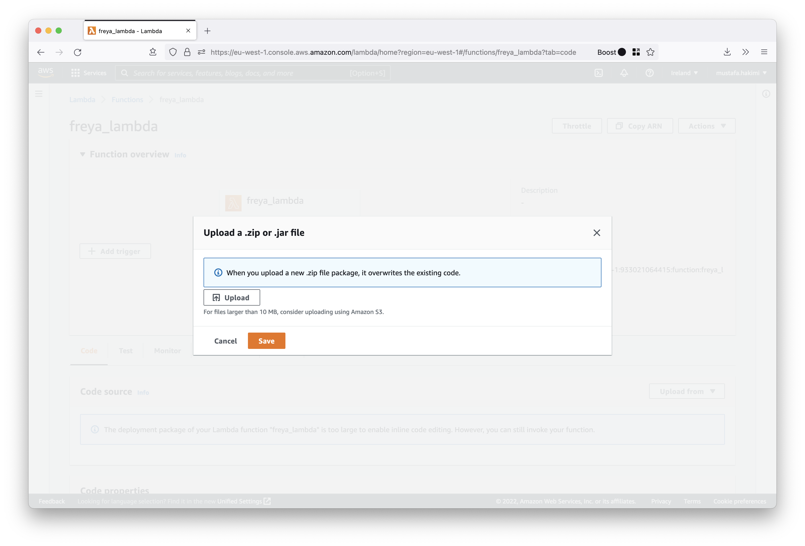

# Freya Infrastructure

* [AWS Credentials](#aws-credentials)
  * [Shared Configuration and Credentials Files](#shared-configuration-and-credentials-files)
  * [Environment Variables](#environment-variables)
* [Lambda](#lambda)
  * [Automatically Deploying Code](#automatically-deploying-code)
  * [Manually Deploying Code](#manually-deploying-code)

### AWS Credentials
The AWS provider is used to interact with resources supported by AWS. The provider
is configured with the proper credentials before usage. The configuration for the AWS
provider is derived from Environment variables or using Shared Configuration and Credentials Files

#### Shared Configuration and Credentials Files
The AWS CLI stores sensitive credential information that you specify with `aws configure` in a local
file named `credentials`, in a folder named `.aws` in the home directory.

`~/.aws/credentials`
```shell
[default]
aws_access_key_id = <some-access-key>
aws_secret_access_key = <some-secret-access-key>
```
`~/.aws/config`
```shell
[default]
region = us-west-2
output = json
```

The Terraform AWS provider can source credentials from the `~/.aws` directory. If no named profile
is specified, the `default` profile is used.
```terraform
provider "aws" {
  region = "eu-west-1"
}
```

#### Environment Variables
Credentials can also be provided by using the `AWS_ACCESS_KEY_ID`, and `AWS_SECRET_ACCESS_KEY` environment variables.
For example:
```terraform
provider "aws" {
  region = "eu-west-1"
}
```
```shell
$ export AWS_ACCESS_KEY_ID="some-access-key"
$ export AWS_SECRET_ACCESS_KEY="some-secret-access-key"
```

### Lambda
#### Automatically Deploying Code
The configuration inside the AWS Lambda details specifies `s3_bucket` and `s3_key`. These 
are the Lambda deploy bucket and s3 key object. 
```shell
resource "aws_lambda_function" "freya_lambda" {
  s3_bucket = "some-bucket"
  s3_key    = "some-key"
}
```
Terraform will instruct AWS to deploy the Lambda code from the s3 object. 

#### Manually Deploying Code
You can deploy code manually using the AWS CLI or through the AWS Console. 
Simply navigate to the Lambda function → Code → Code source → Upload From 


